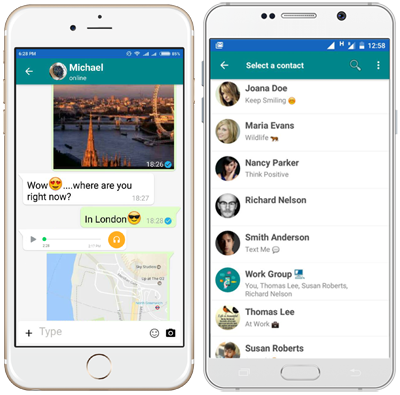

## SD-3101 [Laguna University Community Connect]


## Table of Contents

- [Introduction](#introduction)
- [Project Overview](#project-overview)
- [Target Audience](#target-audience)
- [Objectives](#objectives)
- [Features](#features)
- [Technologies Used](#technologies-used)
- [Setup and Installation](#setup-and-installation)
- [Usage Instructions](#usage-instructions)
- [Project Structure](#project-structure)
- [Contributors](#contributors)
- [Chagelog](#changelog)
- [Acknowledgments](#acknowledgments)
- [License](#license)

---

## Introduction

Mesibo Messenger is an open-source, real-time messaging application that includes voice and video calling features. The purpose of this project is to develop a fully functional messaging app for Android, offering rich communication tools for users and groups.

## Project Overview

Mesibo Messenger for Android is a powerful real-time communication application designed to provide one-on-one and group messaging, high-quality video and voice calls, and file sharing. The project showcases the use of Mesibo's SDK to create a feature-rich communication app with a modern user interface.

## Target Audience

This project is aimed at developers and students looking to build messaging apps or WhatsApp-like solutions, with real-world applications in both personal communication and enterprise-level collaboration.

## Objectives

The main objectives of this capstone project are:

Build a fully functional messaging application for Android.
Implement rich features such as messaging, voice and video calls, file sharing, and geolocation integration.
Provide end-to-end encryption to ensure data security.
Host a backend server to support the app.

## Features

One-on-One Messaging: Send and receive text messages.
Group Chat: Create and manage group chats with multiple participants.
Voice and Video Calls: High-quality, real-time communication.
Conferencing: Hold voice and video conferences.
File Sharing: Share pictures, videos, and audio files.
End-to-End Encryption: Secure all communications.
Location Sharing: Share your location in real time.
Typing Indicators & Message Status: See when others are typing or when your message is delivered/read.
Push Notifications: Get notified when you receive a message or call.

## Technologies Used

Programming Languages: Java, Kotlin
Frameworks/Libraries: Mesibo SDK, Android SDK, Google Maps SDK
Databases: Firebase (for push notifications), SQLite
Other Tools: Git, Android Studio, Google Places API

## Setup and Installation

To set up and run the project on your local environment, follow these steps:

Clone the repository:
bash
Copy code
git clone https://github.com/mesibo/messenger-app-android.git
Install dependencies: Open the project in Android Studio, and it will automatically download all required dependencies.
Configure environment variables: Set up your Mesibo API key in the project’s build.gradle file or create an environment file for sensitive data.
Run the project:
Launch Android Studio, then:
Click Run -> Run app to build and launch the app on your device/emulator.

## Usage Instructions

After setting up the app, you can log in using a valid phone number and an OTP generated from the Mesibo Console. Once logged in, the app will automatically sync your contacts and allow you to start messaging or calling.

Key Actions:
Messaging: Select a contact, type a message, and hit send.
Voice/Video Call: Tap on a contact and select the call option for either voice or video.
Sharing Media: Use the media button to send pictures, videos, or files.
Screenshots of the app in use:

Another Screenshot:



## Project Structure

```bash

├── app/
│   ├── src/
│   │   ├── main/
│   │   └── res/
├── build/
├── gradle/
├── .gitignore
├── build.gradle
├── README.md
└── LICENSE
```

## Contributors

1. Ranielle Anthony J. Luistro, Backend Integration
2. Jireh Fei San Juan, UI/UX Designer
3. Gerald Villaran: Project Manager, Tester

## Acknowledgments

This project was built using the Mesibo Messenger as a base. We would like to thank the Mesibo team for their open-source resources and documentation, which made this project possible.

This project was built from [Original Project Name](https://github.com/mesibo/messenger-app-android), created by [Original Author's Name]. You can view the original repository [here](https://github.com/mesibo/messenger-app-android).
## Project Timeline
• Week 1-2: Collaborative Brainstorming for Feature Development

  ◦ 09/15/2024
  
  ◦ https://www.youtube.com/watch?v=qAwml1JgZxQ&t=9s
  
   ◦ Proposes Features 
   1.voice record
   2. User note
   3. User myday
   4. Group polls
   5.Backg ground themes
   6. Message pinning
   7.Forgot Password
   8.Group mentions
   9.Group album
  10.Scheduled messages

• Week 3-5: Design and setup.

• Week 6-10: Implementation.

• Week 11-12: Testing and debugging.

• Week 13-14: Final presentation and documentation.
     
## Changelog

### [Version 1.0.0] - 2024-09-07

- Initial release of the project.
- Added basic functionality for [Feature 1], [Feature 2], and [Feature 3].

### [Version 1.1.0] - 2024-09-14

- Improved user interface for [Feature 1].
- Fixed bugs related to [Feature 2].
- Updated project documentation with setup instructions.

## License

This project is licensed under the MIT License. Please refer to the LICENSE file for more details.
